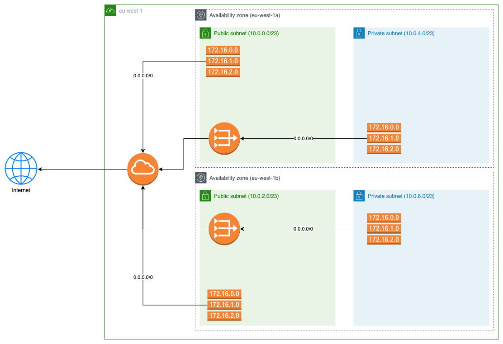

# Terraform VPC Challenge

This project creates a VPC using Terraform, the diagram below lays out the general architecture created.

- A VPC is created in which there are an equal amount of public/private subnets (set by a variable)
- Each public subnet is in its own availability zone and is connected to the internet via an Internet Gateway
- Each private subnet has its own availability zone and is connected to the internet have a NAT gateway
- There is an equal number of NAT gateways as there are private subnets, each placed in a public subnet of their respective AZ 

## CIDRs

### VPC CIDR

- `10.0.0.0/20`

### Public Subnets

- `10.0.0.0/23`
- `10.0.2.0/23`
- `10.0.4.0/23`

### Private Subnets

- `10.0.6.0/23`
- `10.0.8.0/23`
- `10.0.10.0/23`